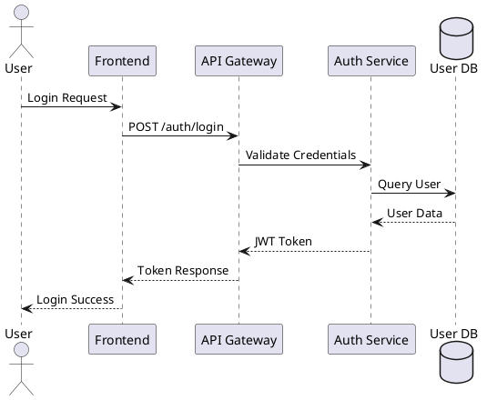
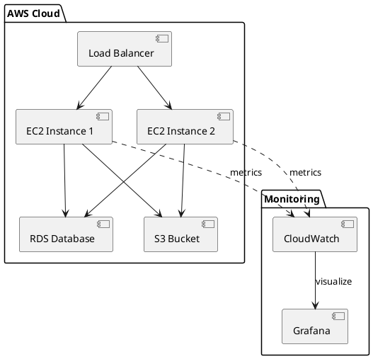
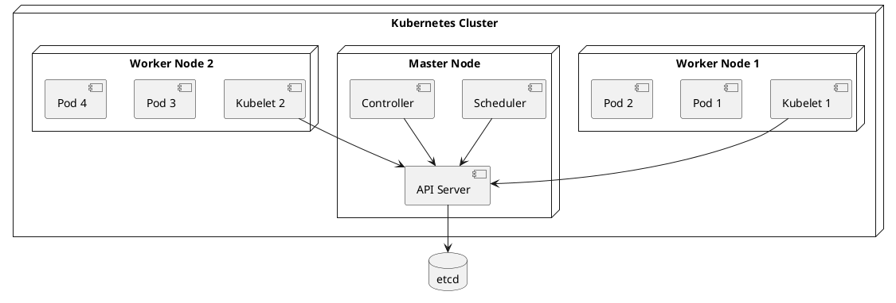
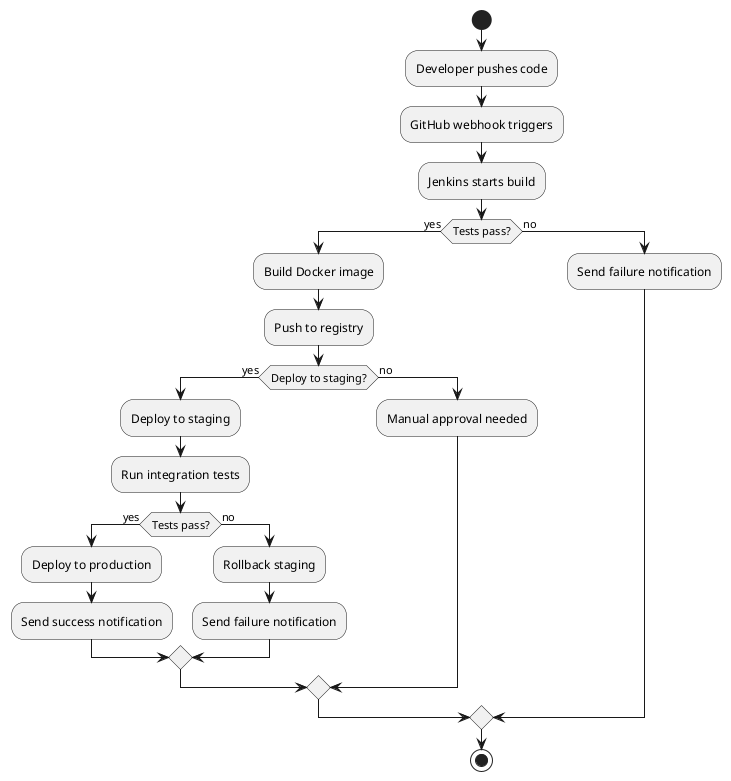
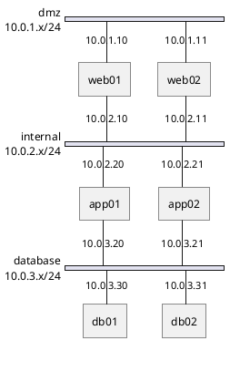
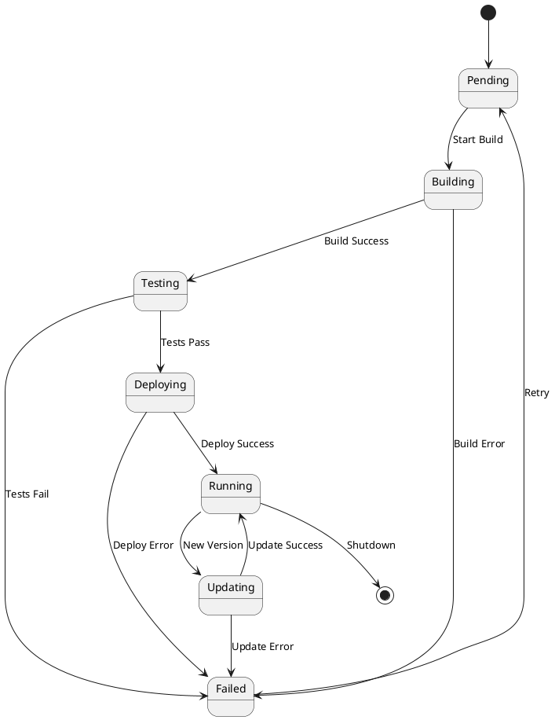
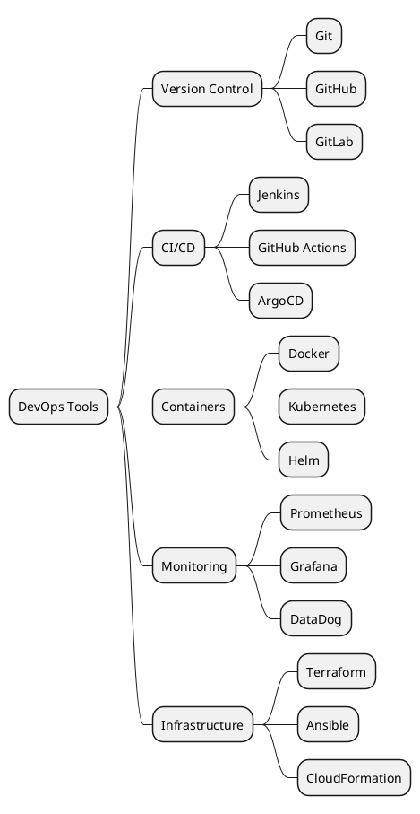
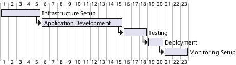

## Introduction

PlantUML is a powerful tool for creating diagrams from plain text. This guide shows various diagram types useful for documenting cloud infrastructure and DevOps workflows.

---

## Sequence Diagram: API Authentication Flow

This sequence diagram shows a typical authentication flow in a microservices architecture.

---

## Component Diagram: Cloud Infrastructure

This shows a typical AWS infrastructure setup with load balancing, auto-scaling, and monitoring.

---

## Deployment Diagram: Kubernetes Architecture

Kubernetes cluster architecture showing master and worker nodes.

---

## Activity Diagram: CI/CD Pipeline

This activity diagram shows a complete CI/CD pipeline workflow.

---

## Network Diagram: Multi-Tier Architecture

Network topology showing DMZ, application, and database tiers.

---

## State Diagram: Deployment States

State machine for application deployment lifecycle.

---

## Mind Map: DevOps Tools

Mind map organizing DevOps tools by category.

---

## Gantt Chart: Project Timeline

Project timeline for a typical deployment project.

---

## Summary

PlantUML is an incredibly versatile tool for creating professional diagrams. Key benefits:

- ✅ **Text-based**: Easy to version control
- ✅ **Consistent**: Automatic layout and styling
- ✅ **Fast**: Quick to create and modify
- ✅ **Comprehensive**: Supports many diagram types
- ✅ **Free**: Open source with free public server

For more diagram types and syntax, visit [PlantUML.com](https://plantuml.com).

